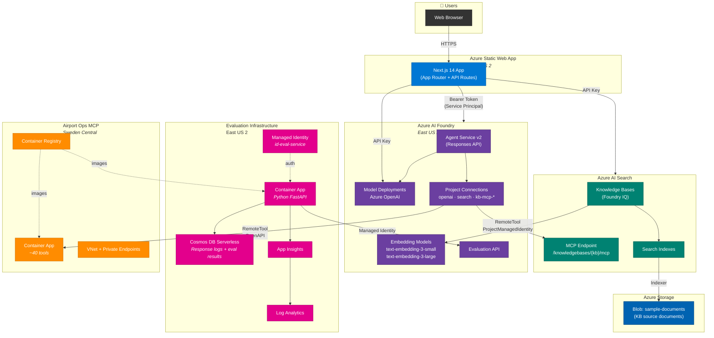
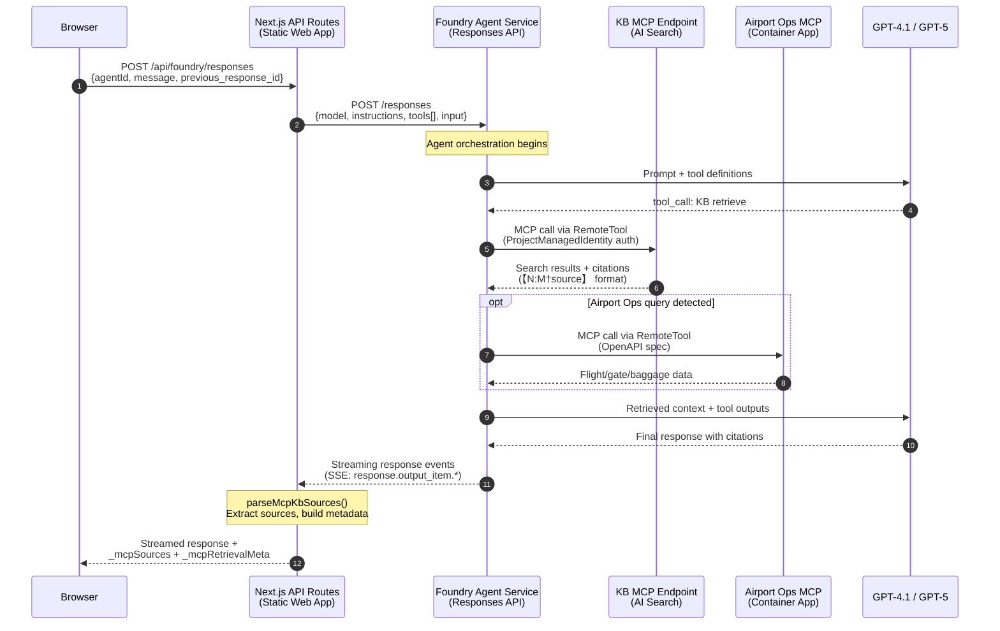
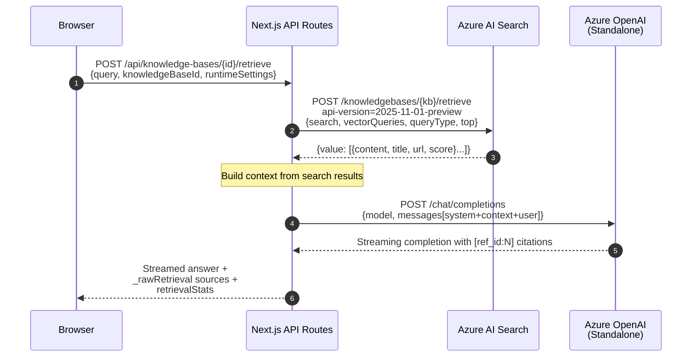
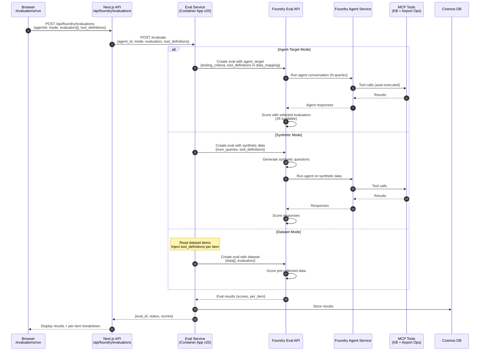
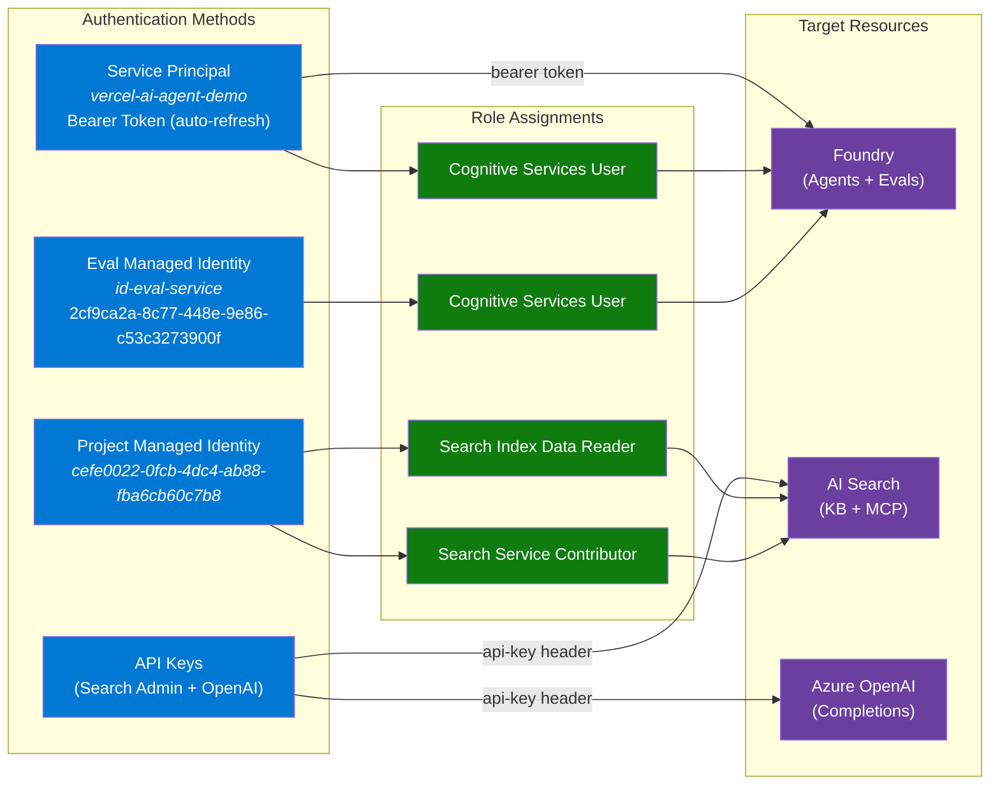
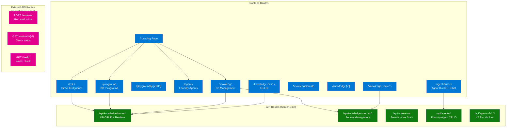

# Foundry IQ Demo — Architecture & Data Flow

> **Last Updated:** 2025-04-11
> **Project:** Qatar Airways Contact Center Operator Companion

---

## 1. High-Level Architecture

The first diagram shows all Azure resources across both resource groups, their relationships, and primary communication protocols:

- **Next.js 14** runs on Azure Static Web App, serves as both frontend and API gateway
- **Foundry Agent Service** orchestrates agent conversations, calling tools via MCP connections
- **Two MCP tool sources**: KB MCP (Azure AI Search native) and Airport Ops MCP (custom Container App in Sweden Central)
- **Eval infrastructure** is a separate FastAPI Container App with its own Managed Identity, Cosmos DB, and observability stack

---

## 2. Agent Chat Data Flow

Shows the step-by-step request lifecycle when a user sends a message through the Agent Builder:

1. Browser → Next.js API route → Foundry Responses API
2. Foundry orchestrates: LLM decides which tools to call → MCP KB retrieval (via `ProjectManagedIdentity`) and/or Airport Ops MCP
3. Results stream back as SSE events, parsed by `parseMcpKbSources()` into structured sources + retrieval metadata

---

## 3. KB Playground Data Flow

The direct query path (no Foundry agent involved):

1. Browser → Next.js → Azure AI Search `retrieve` API (direct REST)
2. Search results passed as context to standalone Azure OpenAI
3. Completions streamed with `[ref_id:N]` citation format

---

## 4. Evaluation Pipeline

Three evaluation modes all flow through the eval service:

| Mode | Data Source | Agent Execution |
|------|------------|-----------------|
| **Agent-Target** | Foundry-generated queries | Agent runs live with MCP tools |
| **Synthetic** | AI-generated questions | Agent runs live with MCP tools |
| **Dataset** | Pre-collected Q&A pairs | No agent execution (scoring only) |

All modes auto-inject `tool_definitions` from the agent definition for tool-call evaluators.

---

## 5. Authentication & RBAC

| Identity | Authenticates To | Method |
|----------|-----------------|--------|
| Service Principal | Foundry (Agents + Evals) | Bearer token (auto-refresh) |
| Project MI (`cefe0022...`) | AI Search (MCP calls) | Search Index Data Reader + Contributor |
| Eval MI (`id-eval-service`) | Foundry Eval API | Cognitive Services User |
| API Keys | Search + OpenAI | `api-key` header |

---

## 6. Application Route Map

---

## 7. Resource Inventory

### `iqpoc` Resource Group (East US 2) — 14 resources

| Resource | Type | Purpose |
|----------|------|---------|
| `aikb-web-q36gpyt3maa7w` | Static Web App | Next.js frontend + API routes |
| `aikb-foundry-q36gpyt3maa7w` | CognitiveServices | AI Services (8 model deployments) |
| `aikb-search-q36gpyt3maa7w` | AI Search (Basic) | Knowledge Bases, MCP endpoints, indexes |
| `aikbstorageq36gpyt3maa7w` | Storage | KB source documents (blob) |
| `aikb-hub-q36gpyt3maa7w` | ML Hub | Foundry hub workspace |
| `aikb-project-q36gpyt3maa7w` | ML Project | Foundry project workspace |
| `ca-eval-service` | Container App | Python FastAPI eval service (v20) |
| `cae-eval-iqpoc` | Container Apps Env | Hosts eval service |
| `id-eval-service` | Managed Identity | Eval service auth |
| `cosmos-eval-iqpoc` | Cosmos DB (Serverless) | Response logs + eval results |
| `log-eval-iqpoc` | Log Analytics | Eval service logging |
| `appi-eval-iqpoc` | Application Insights | Eval telemetry |

### `rg-hiacoo-mcp-private` (Sweden Central) — Cross-RG resources used

| Resource | Type | Purpose |
|----------|------|---------|
| `cronlgvc76rbuge` | ACR | Container images (eval-service + airport-ops) |
| `ca-pizza-mcp-onlgvc76rbuge` | Container App | Airport Ops MCP server (~40 tools) |
| `vnet-mcp-onlgvc76rbuge` | VNet | Private networking for MCP infra |

### Foundry Project Connections

| Connection | Type | Target |
|-----------|------|--------|
| `openai-connection` | AzureOpenAI | `aikb-openai-q36gpyt3maa7w` |
| `search-connection` | CognitiveSearch | `aikb-search-q36gpyt3maa7w` |
| `kb-mcp-test41mini` | RemoteTool | KB MCP endpoint (auto-created per KB) |

### Model Deployments

| Model | Deployment Name | Purpose |
|-------|----------------|---------|
| `gpt-4.1` | gpt-4.1 | Primary agent model |
| `gpt-4.1-mini` | gpt-4.1-mini | Fast/cheap agent model |
| `gpt-5` | gpt-5 | Advanced reasoning |
| `gpt-5.2` | gpt-5.2 | Latest reasoning |
| `gpt-5.4-mini` | gpt-5.4-mini | Efficient reasoning |
| `gpt-4o-mini` | gpt-4o-mini | Legacy / fallback |
| `text-embedding-3-small` | text-embedding-3-small | KB vectorization |
| `text-embedding-3-large` | text-embedding-3-large | High-dim KB vectorization |

---

## 8. Environment Variables

| Variable | Required | Purpose |
|----------|----------|---------|
| `AZURE_SEARCH_ENDPOINT` | Yes | AI Search service URL |
| `AZURE_SEARCH_API_KEY` | Yes | AI Search admin/query key |
| `AZURE_SEARCH_API_VERSION` | Yes | Search API version (`2025-11-01-preview`) |
| `NEXT_PUBLIC_AZURE_OPENAI_ENDPOINT` | Yes | Azure OpenAI endpoint (Foundry AI Services) |
| `AZURE_OPENAI_API_KEY` | Yes | Azure OpenAI key |
| `NEXT_PUBLIC_STANDALONE_AOAI_ENDPOINT` | Yes | Standalone OpenAI endpoint (higher rate limits) |
| `NEXT_PUBLIC_STANDALONE_AOAI_KEY` | Yes | Standalone OpenAI key |
| `FOUNDRY_PROJECT_ENDPOINT` | Yes | Foundry project endpoint URL |
| `FOUNDRY_CS_PROJECT_ARM_ID` | Yes | CognitiveServices project ARM ID (for MCP connections) |
| `AZURE_AUTH_METHOD` | Yes | `service-principal` / `managed-identity` |
| `AZURE_TENANT_ID` | SP | Service principal tenant |
| `AZURE_CLIENT_ID` | SP | Service principal app ID |
| `AZURE_CLIENT_SECRET` | SP | Service principal password |
| `NEXT_PUBLIC_SEARCH_ENDPOINT` | Yes | Public search endpoint (for MCP URLs) |

---

**END OF DOCUMENT**
